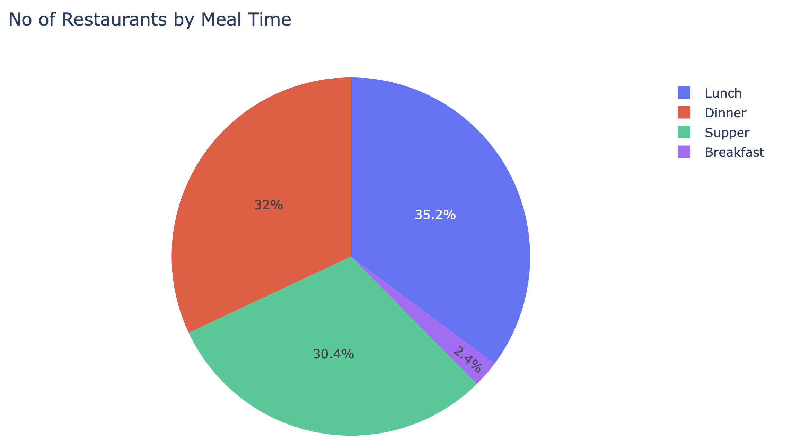

# Background

Given a list of restaurants and the corresponding operating hours, we would like to perform certain queries and identify patteerns

# Purpose

- To ingest one or multiple CSV file with following columns `dining_place_name,operating_hours`
- To query matching restaurants based on following criteria:
- Day of week
- Day of week and timing
- List of names

# Guides

## Getting Started

You could click on the `launch on binder` to open the dashboard.
If required to launch locally, please follow the instructions below

### Install dependencies

```
pip install -r requirements.txt
```

### Launch notebook

```
jupyter notebook RestaurauntTracker.ipynb
```

## Use Cases


### Search with name

You could enter any text and any restaurants that partially matches the said text will be displayed.
In addition, you could also separate keywords with `,`.

### Filter by day of week and time

- If `show me what's open is checked`, the opening time of restaurant will be automatically set to current time
- You could select multiple day of week

# Interesting facts about the data

Do take note that this section is static and purely based on the 2 CSV provided.





# Appendix

## Assumptions

- Timezone of restarurants' operating hours assumed to be same as local timezone

## Challenges

- Ensure proper parsing of CSV files as well as parsing the time format to managable structure
